# Code 401: Prework

## SQL Practice

[Home](https://mtorres6739.github.io/reading-notes/)

## Summary

During this pre work assignment I worked on a tutorial for learning SQL commands.  The first part was working with SQL queries, and the second part was working Database Management.  I found that working with SQL is very similar to working with excel.  One of the major differences is in order to work with the data, you need to enter commands instead of using a graphical user interface.  I have a good understanding of how the data is structured and how to work with it, however, learning the commands is going to take some time.  I am looking forward to learning more about SQL and how to use it to work with data.

### SQL Lesson 1

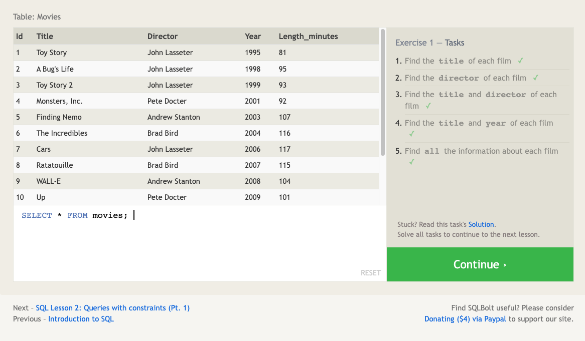

### SQL Lesson 2

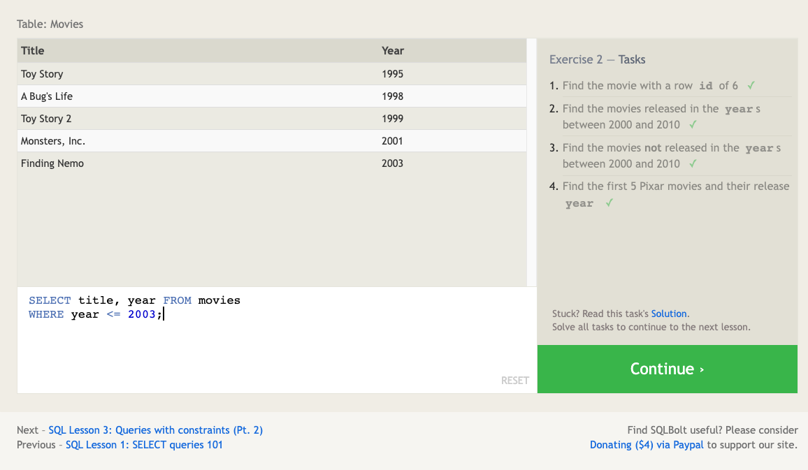

### SQL Lesson 3

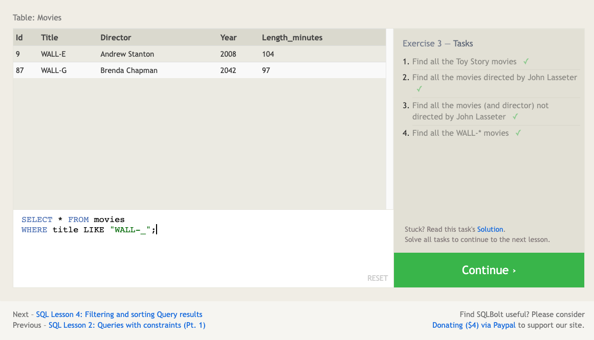

### SQL Lesson 4

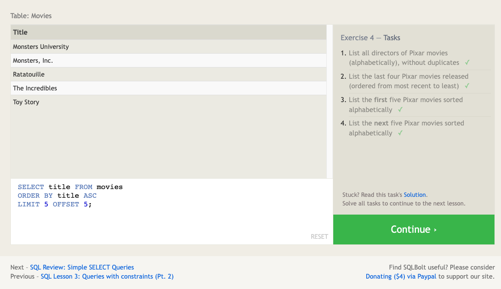

### SQL Lesson 5

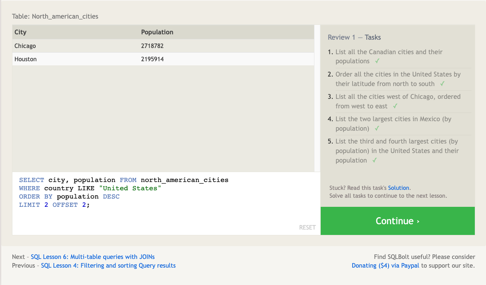

### SQL Lesson 6

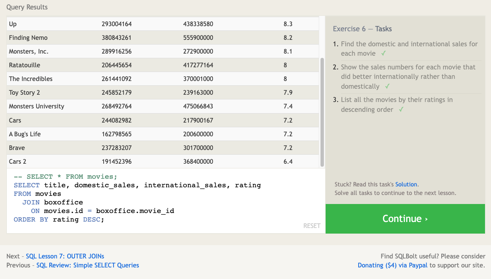

### SQL Lesson 13

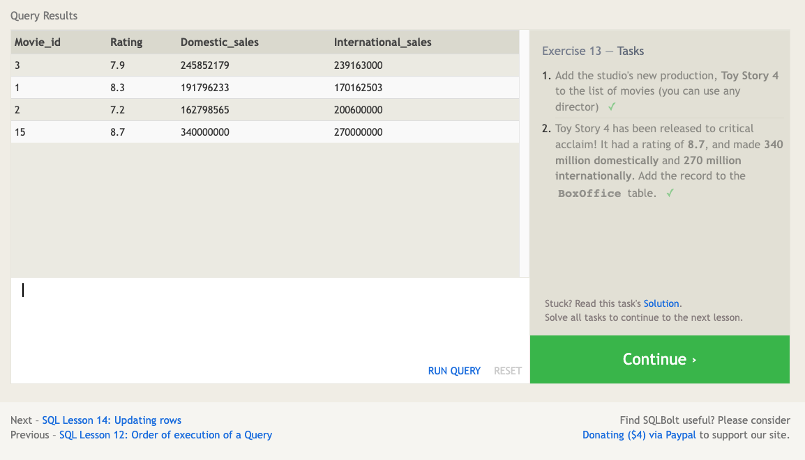

### SQL Lesson 14

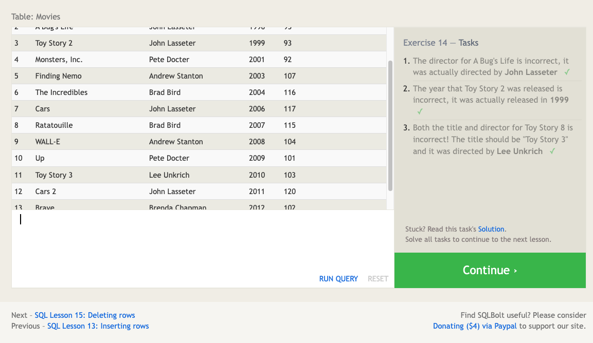

### SQL Lesson 15

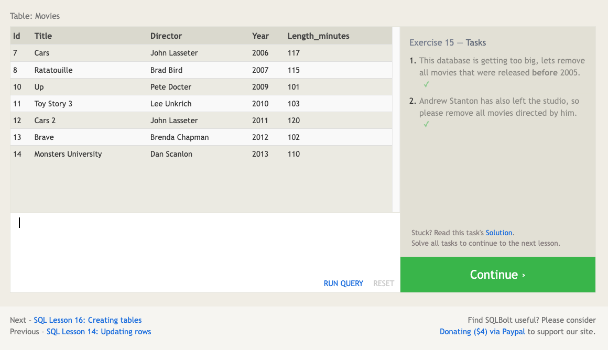

### SQL Lesson 16

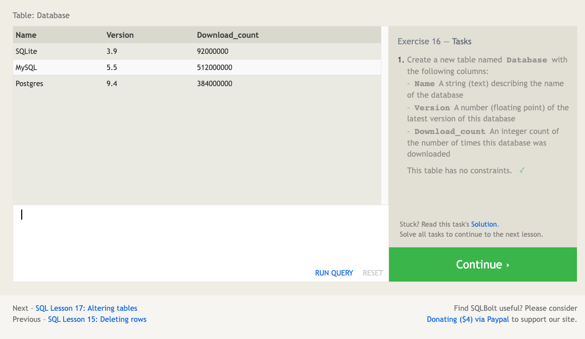

### SQL Lesson 17

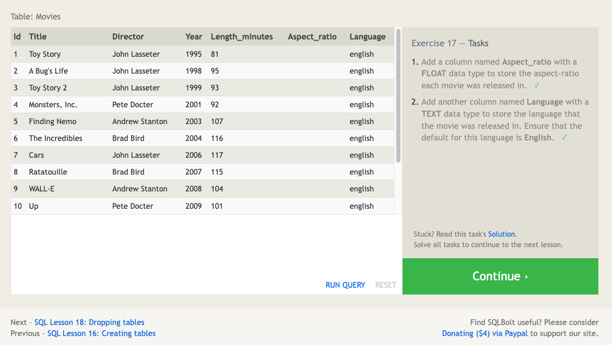

### SQL Lesson 18

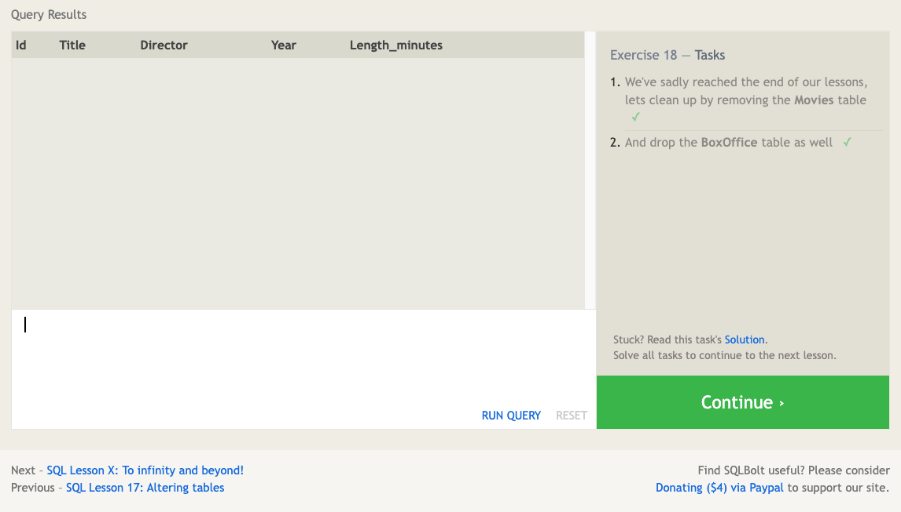

